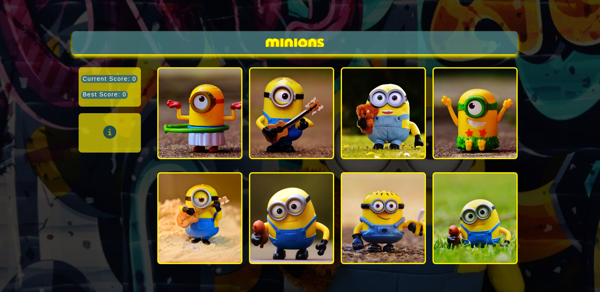
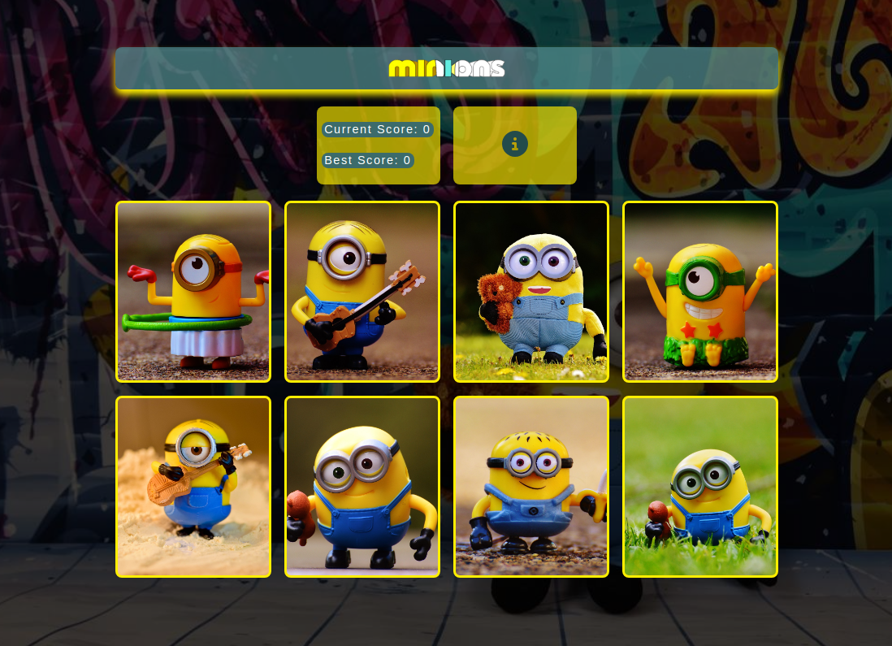
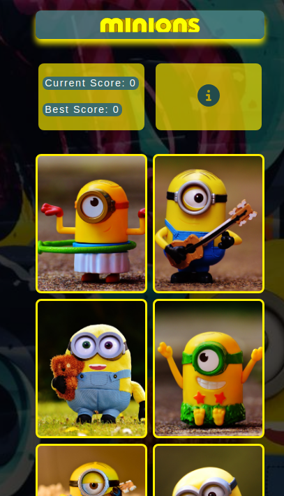

<div align='center'>

# Memory Card Game

</div>
<div align='center'>
    <h3>💻 Languages</h3>
    
    
    
    <h3>🔧 Technologies</h3>
    
    
    
    
    
    
    
    
    
    
    
    
    
    <h4><a href="https://memory-card-snowy-three.vercel.app/">Live Preview</a></h4>
</div>

**Demo:**


<details>

**<summary>Screen views</summary>**

**Desktop View:**


<br>

**Tablet View:**


<br>

**Mobile View:**



</details>

## 🌐 Origin

[The Odin Project](https://www.theodinproject.com/)

## 📝 Description

Builds a memory card game.

<details>
<summary>Features</summary>

- Loads to display status - Initializing page, after loss, and win.
- Displays info on hover.
- Updates scores in real-time.
- 3d interaction effect on cards.

</details>

## 🎯 Relevance

To solidify concepts of `State and Effects` in React.

## 👥 Intended Audience

Developers, users, recruiters.

> [!NOTE]
> Users can install all dependencies using `package.json` file via:
>
> ```bash
> npm install
> ```

## 📂 Files

<details>
<summary>Invert</summary>

| File                             | Description                                                                                                                                                             |
| -------------------------------- | ----------------------------------------------------------------------------------------------------------------------------------------------------------------------- |
| `src/*`                          | Source files that are bundled into the output directory `dist/`.                                                                                                        |
| `src/main.jsx`                   | The main JavaScript entry point that bundling begins.                                                                                                                   |
| `src/App.jsx`                    | Main component where overall structure and other layout components of the app are contained.                                                                            |
| `src/assets/*`                   | All assets(imgs, icons, vids) used in website.                                                                                                                          |
| `src/components/Boilerplate.jsx` | All components in body assembles here.                                                                                                                                  |
| `src/components/Card.jsx`        | Creates each card.                                                                                                                                                      |
| `src/components/FetchImgs.jsx`   | Fetches all image urls.                                                                                                                                                 |
| `src/components/ids.js`          | Generates ids with [uuid](https://www.npmjs.com/package/uuid).                                                                                                          |
| `src/components/Info.jsx`        | Displays info section.                                                                                                                                                  |
| `src/components/Loading.jsx`     | Creates a loading display with two props: `gif` and `text`.                                                                                                             |
| `src/components/Score.jsx`       | Displays Score section.                                                                                                                                                 |
| `src/styles/App.css`             | Main stylesheet for entire site.                                                                                                                                        |
| `src/styles/reset.css`           | Sets style to default for consistency across different devices and browsers.                                                                                            |
| `dist/*`                         | Output files from bundling of files in directory `src/`.                                                                                                                |
| `dist/main.js`                   | Main JavaScript output file that contains the bundled JavaScript code. Code is minified and optimized for deployment (Due to mode set to production in webpack config). |
| `package*`                       | Contains details of project and dependencies versions.                                                                                                                  |
| `readme-assets/*`                | Live demo and different screen views used in `README.md`.                                                                                                               |

</details>

## ©️ Credit

<details>
<summary>Invert</summary>

| File                    | Description                                                            |
| ----------------------- | ---------------------------------------------------------------------- |
| `src/assets/banana.png` | Photo created by Meesgroothuis on [Pixabay](https://pixabay.com/).     |
| `src/assets/bg.jpg`     | Photo created by Alexas Fotos on [Pixabay](https://pixabay.com/).      |
| `Fetched Images`        | Photos created by Alexas Fotos on [Pixabay API](https://pixabay.com/). |
| `src/assets/*.gif`      | Photo from [Giphy](https://giphy.com/).                                |

</details>

## 🔄 Improvements

<details>
<summary>Invert</summary>

- [ ] Fix load resource error in console.
- [ ] Add sound.
- [ ] Use an svg favicon.
- [ ] Make flip appear 3d.
- [ ] Display remaining moves at bottom (n/8).
- [ ] Make sure images fully appear before Loading ends.
- [ ] Add difficulty level.

</details>

## 👤 Curator

1. [Abraham Da Costa Silvanus](https://github.com/asdacosta)

<br>

> [!IMPORTANT]
> Seek contributor's consent for any code usage.

**[🞁 Top](#template)**
